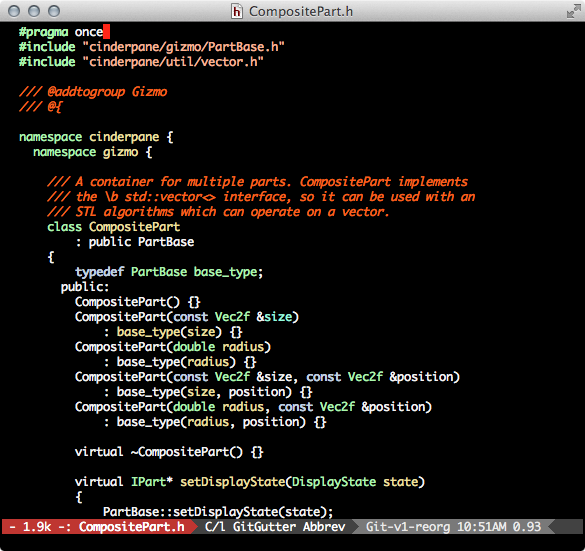
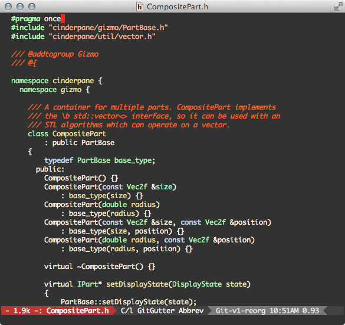
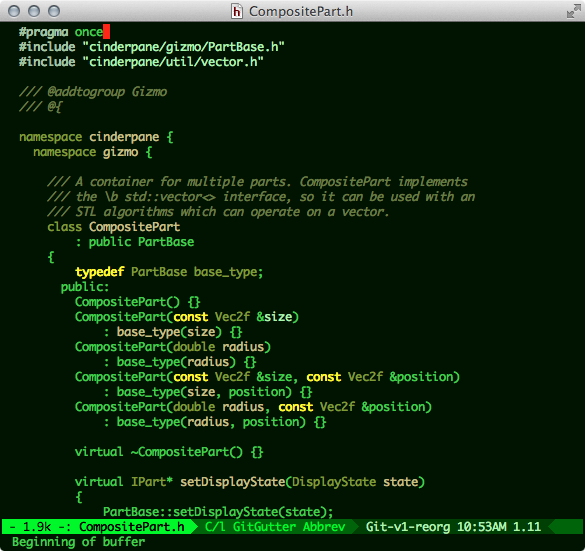

# dotfiles

My collection of dotfiles, for [zsh](http://www.zsh.org/) and
[emacs](http://www.gnu.org/software/emacs), primarily. I've been
toting these around from one system to another since 1992.

[Homesick](https://github.com/technicalpickles/homesick) is a pretty
good way to keep your dotfiles in sync via github and symlinks.

## Emacs Color Themes

Once upon a time, before emacs had a color theme system (or three) of its own, I wrote a bunch of functions in my .emacs config that set font-lock faces to my liking. They didn't play very nicely with Emacs 24's built-in theming system (I did write them of Emacs 19, after all), so I converted them to proper color themes. I mostly use ``aalpern-dark`` and ``autumn-light``. They are not comprehensive in setting faces for every popular major mode out there - I mostly only care about font-lock.

[autumn-light](https://github.com/aalpern/emacs-color-theme-autumn-light) and [green-phosphor](https://github.com/aalpern/emacs-color-theme-green-phosphor) now have their own repositories, and can be installed by Emacs 24's package manager from the [MELPA](http://melpa.org/) archive.

### Light Themes

``autumn-light``:

``better-github``:

``aalpern-light``:

### Dark Themes

``aalpern-dark``:

``aalpern-dark2``:

``green-phosphor``:

